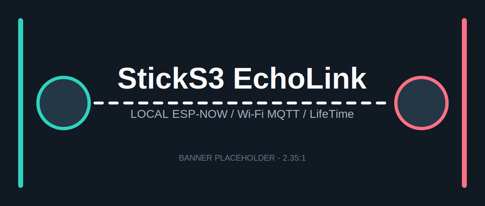

# StickS3 EchoLink

<p align="center">
  
</p>

<p align="center">
  <strong>把两台 M5StickS3 变成可近距直连、也可通过 Wi-Fi 跨网络通信的按键对讲机。</strong>
</p>

<p align="center">
  <a href="https://github.com/XksA-me/StickS3-EchoLink/actions/workflows/build.yml"></a>
  
  
</p>

StickS3 EchoLink 是一套运行在 M5StickS3 上的单固件双应用项目：

- **EchoLink**：短按收听、长按说话；支持 ESP-NOW 短距离直连和 Wi-Fi MQTT 跨网络通信。
- **LifeTime**：电量与木鱼计数、体感沙漏，以及两台设备之间的摇一摇互动。

固件采用异步 MQTT、PSRAM 语音队列和整帧 UI 渲染。网络发送不会卡住按键、录音和播放；屏幕、IMU、音频编解码器和任务轮询也做了待机功耗控制。

## 硬件

当前目标硬件为 **M5StickS3**：

| 项目 | 规格 |
| --- | --- |
| SoC | ESP32-S3-PICO-1-N8R8 |
| Flash / PSRAM | 8 MB / 8 MB |
| 屏幕 | ST7789P3，135 x 240 |
| 音频 | ES8311、MEMS 麦克风、AW8737 功放 |
| 无线 | 2.4 GHz Wi-Fi、ESP-NOW |
| 电池 | 250 mAh |

按键名称：正面按键是 **A**，右侧按键是 **B**，左侧按键主要用于开关机。

## 当前功能

### EchoLink 对讲

- 最长 8 秒、16 kHz、8-bit 单声道语音。
- `LOCAL`：ESP-NOW 广播，不依赖路由器或 Internet。
- `WIFI`：Wi-Fi + MQTT，两台设备可位于不同网络。
- 新消息以最大音量连续提示 3 声，每声间隔 0.6 秒；按 `A` 播放最近未读消息，最多保留 5 条。
- 录音完成立即返回界面，语音在后台发送；最多缓存 5 条待发消息。
- MQTT 运行在独立 FreeRTOS 任务，断线后自动重连并重新发送完整消息。
- 设备网页配置 Wi-Fi 和 MQTT，最多保存 5 个 Wi-Fi。
- 网页可输入 0.1-60 秒的 MQTT 消息检查间隔。
- 可选服务器 Recorder，将完整语音保存为 WAV 和 JSONL 元数据。

### LifeTime

- `BATTERY`：大号电量、端电压、粗略续航估算和持久化木鱼计数。
- `HOURGLASS`：根据设备六个稳定放置方向选择时长，按 `A` 才开始；翻转后沙漏换向并等待下一次确认。
- `TOGETHER`：双摇或按键向另一台设备发送 Ping，对方播放提示音和脉冲动画。

### 功耗策略

- 15 秒无操作自动降低背光，30 秒后关闭显示。
- 普通黑屏停止 UI 帧提交；省电监听模式还会清零并停止 LifeTime 定时器与互动。
- 麦克风与功放仅在录音、播放、提示音期间启用。
- IMU 只在 LifeTime 前台限频采样。
- MQTT 与主循环采用任务通知和可配置闲时检查间隔，发送与积压接收会立即加速。
- Wi-Fi 默认保留 modem sleep；仅在确认省电导致链路异常后临时关闭。

项目没有启用 Deep Sleep，因为它会中断 ESP-NOW/MQTT 实时接收。更多说明见 [功耗设计](docs/power-management.md)。

## 操作方法

### 全局操作

| 操作 | 作用 |
| --- | --- |
| `A` 双击 | 打开 EchoLink / LifeTime 应用切换页 |
| 电源键单击 | 进入或退出黑屏省电监听，只保留收件与新语音提示 |
| 电源键双击 | 关机（保留设备原有行为） |

应用切换页中，按 `B` 选择应用，短按 `A` 打开。LifeTime 在切换页中使用简短的 `CLOCK` 标签，避免小屏文字溢出。

### EchoLink

| 操作 | 作用 |
| --- | --- |
| 短按 `A` | 播放下一条未读语音；没有未读时不录音 |
| 按住 `A` 超过 1 秒，松开 | 开始录音，松开后加入后台发送队列 |
| `B` 单击 | 切换音量 |
| `B` 双击 | 切换 `LOCAL` / `WIFI` |
| 按住 `B` 2.5 秒 | 开启 5 分钟网络配置入口；配置中短按 `B` 退出 |

### LifeTime

| 页面 | 操作 |
| --- | --- |
| 通用 | `A` 执行当前功能；`B` 切换下一页 |
| BATTERY | `A` 敲木鱼并播放声音 |
| HOURGLASS | 稳定放置一个方向 1 秒后选定；`A` 开始/暂停 |
| TOGETHER | `A` 发送 Ping 并提示；双摇仍可触发 Ping |

## 快速烧录

### 1. 安装环境

需要 Git、Python 3 和 PlatformIO Core：

```sh
python3 -m pip install --user platformio
```

确认命令可用：

```sh
pio --version
```

macOS 上如果 `pio` 不在 `PATH`，可使用 `~/.local/bin/pio`。

### 2. 下载并编译

```sh
git clone git@github.com:XksA-me/StickS3-EchoLink.git
cd StickS3-EchoLink
pio run -e sticks3
```

M5GFX 固定从官方 GitHub `0.2.25` 源码安装，以避开部分地区 PlatformIO 镜像压缩包损坏的问题。第一次克隆和编译可能需要几分钟，后续构建会使用缓存。

### 3. 查找串口

```sh
pio device list
```

常见端口：

- macOS：`/dev/cu.usbmodem14201`
- Linux：`/dev/ttyACM0`
- Windows：`COM3`

### 4. 烧录

```sh
pio run -e sticks3 -t upload --upload-port /dev/cu.usbmodem14201
```

两台设备需要分别执行一次烧录。普通固件升级不会清除 NVS 中保存的 Wi-Fi、MQTT、音量和应用选择。

完整安装说明、下载失败处理和串口监控见 [固件编译与烧录](docs/firmware-build-flash.md)。

## 使用前必须修改

打开 [`include/Config.h`](include/Config.h)：

```cpp
#define ECHOLINK_GROUP_ID 0x4D3A91C7UL
#define ECHOLINK_ESPNOW_CHANNEL 1
```

- 两台设备的 `ECHOLINK_GROUP_ID` 必须相同，建议换成自己的随机 32 位十六进制值。
- `ECHOLINK_GROUP_ID` 只是分组标识，不是密码，也不提供加密。
- 两台设备的 ESP-NOW channel 必须一致。
- 显示亮度、息屏时间和最大录音长度也可在此文件修改。

LifeTime IMU 采样周期、续航估算和六面沙漏时长位于 [`include/LifeTimeConfig.h`](include/LifeTimeConfig.h)。详细字段见 [固件配置](docs/configuration.md)。

## 配置 Wi-Fi 与 MQTT

1. 在 EchoLink 页面长按 `B` 2.5 秒。
2. 手机连接屏幕显示的临时热点 `EchoLink-XXXX`。
3. 打开 `http://192.168.4.1`。
4. 选择附近的 2.4 GHz Wi-Fi，填写密码和 MQTT 信息。
5. 输入消息检查间隔（单位：秒）并选择 `WIFI`，然后保存；也可以在配置页短按 `B`退出。

StickS3 不支持 5 GHz-only Wi-Fi。每台设备独立保存配置，但要远程互通，两台必须使用同一个 Broker、Topic 和 Group ID。

更长的检查间隔会降低 CPU 唤醒频率，也会让新消息提示最多延迟相应时间。Wi-Fi 和 MQTT Socket 仍保持连接；这不是每隔几分钟断网拉取的离线收件箱模式。

仓库附带 Mosquitto + Recorder 的 Docker 部署方案，见 [MQTT 服务器部署](docs/mqtt-server.md)。

## 本机测试

协议和录音归档不需要硬件即可测试：

```sh
./scripts/run_host_sim.sh
```

测试覆盖乱序分片、丢包检测、分组隔离、自广播过滤、8 秒语音长度、双机 Ping 和 WAV 归档。

## 文档

| 文档 | 内容 |
| --- | --- |
| [固件编译与烧录](docs/firmware-build-flash.md) | PlatformIO、源码依赖、端口、上传和监控 |
| [固件配置](docs/configuration.md) | Group ID、ESP-NOW、亮度、续航估算和沙漏时长 |
| [MQTT 服务器部署](docs/mqtt-server.md) | Docker、Mosquitto、认证、Recorder 和运维 |
| [协议与架构](docs/protocol-and-architecture.md) | 数据流、Voice Protocol v2、任务和队列 |
| [功耗设计](docs/power-management.md) | 已实施优化、实时通信取舍和继续优化方向 |
| [故障排查](docs/troubleshooting.md) | 串口、依赖、Wi-Fi、MQTT、录音和显示问题 |

## 当前限制

- MQTT 当前使用 QoS 0，公网抖动时仍可能丢失语音分片。
- 示例服务默认是用户名/密码认证的 `1883` 明文 MQTT，公网正式使用应升级 TLS `8883`。
- ESP-NOW 广播和语音协议目前没有端到端加密。
- Recorder 只有 WAV/JSONL 文件归档，没有 Web 管理后台、搜索和自动清理。
- 同一 Group 内设计为半双工，一次只建议一台设备讲话。

## 反馈与联系

问题可通过 [GitHub Issues](https://github.com/XksA-me/StickS3-EchoLink/issues)、微信或邮件快速反馈：`pythonbrief@163.com`。

<table>
  <tr>
    <td align="center"><br><strong>公众号：简说 Python</strong></td>
    <td align="center"><br><strong>个人微信</strong></td>
  </tr>
</table>

Banner 的替换尺寸见 [`docs/assets/README.md`](docs/assets/README.md)。

## License

本项目采用 [Apache License 2.0](LICENSE)。第三方库遵循各自许可证。
